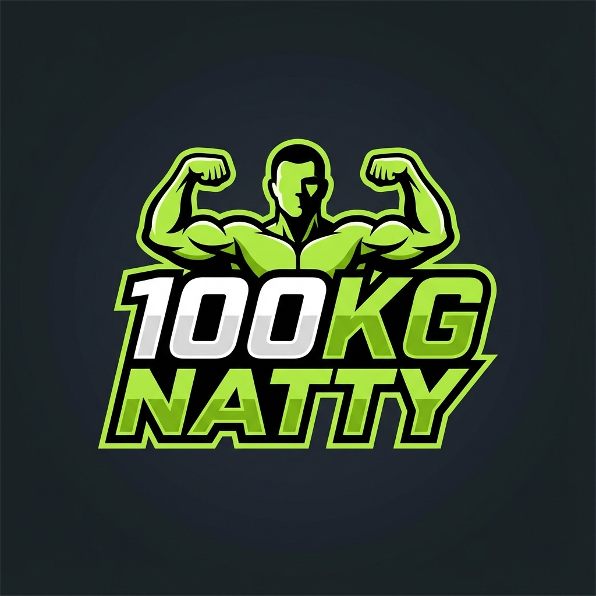
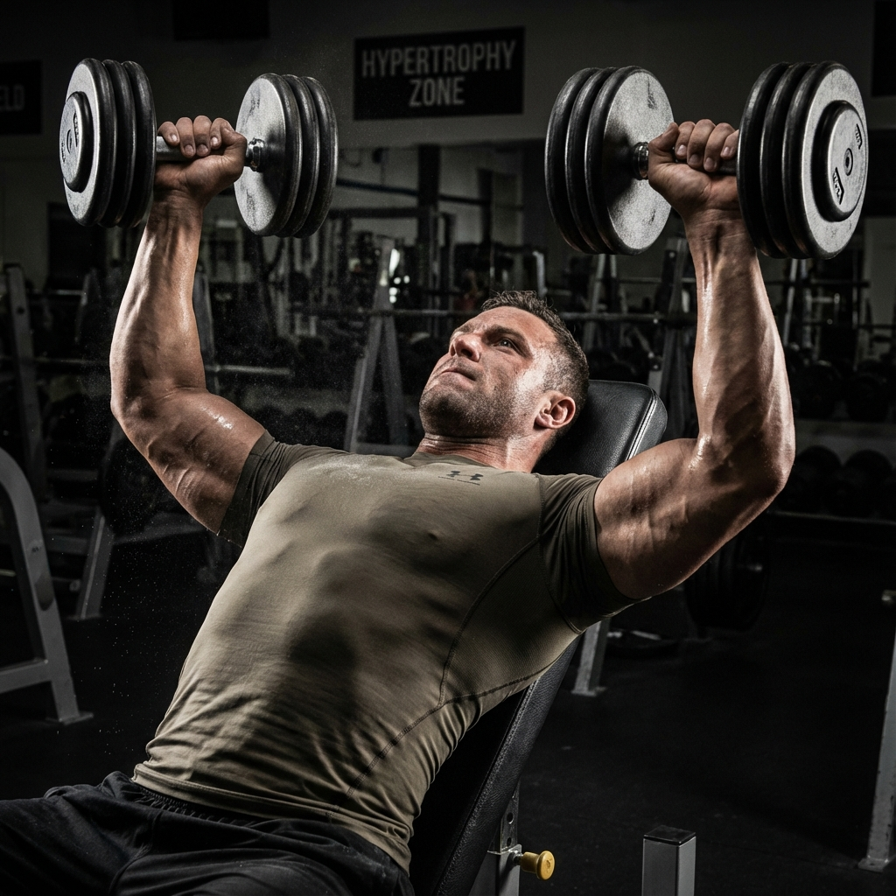
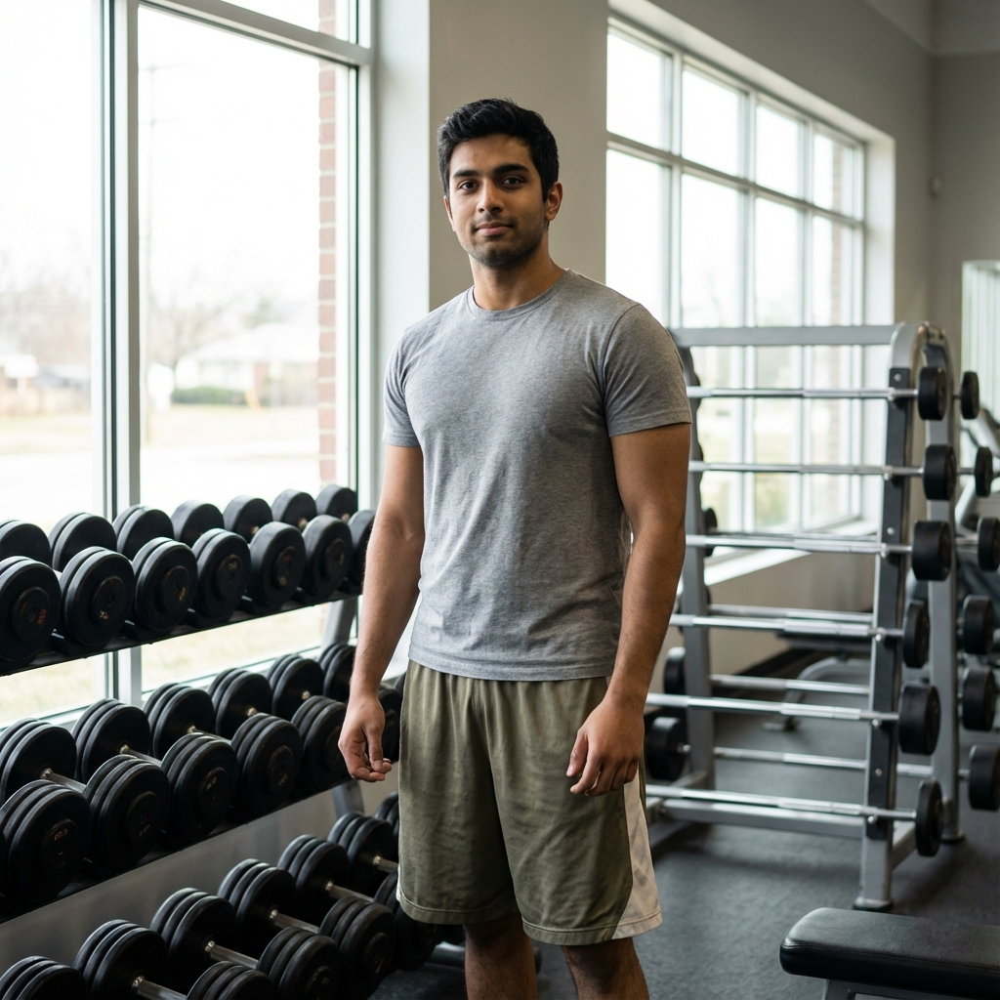
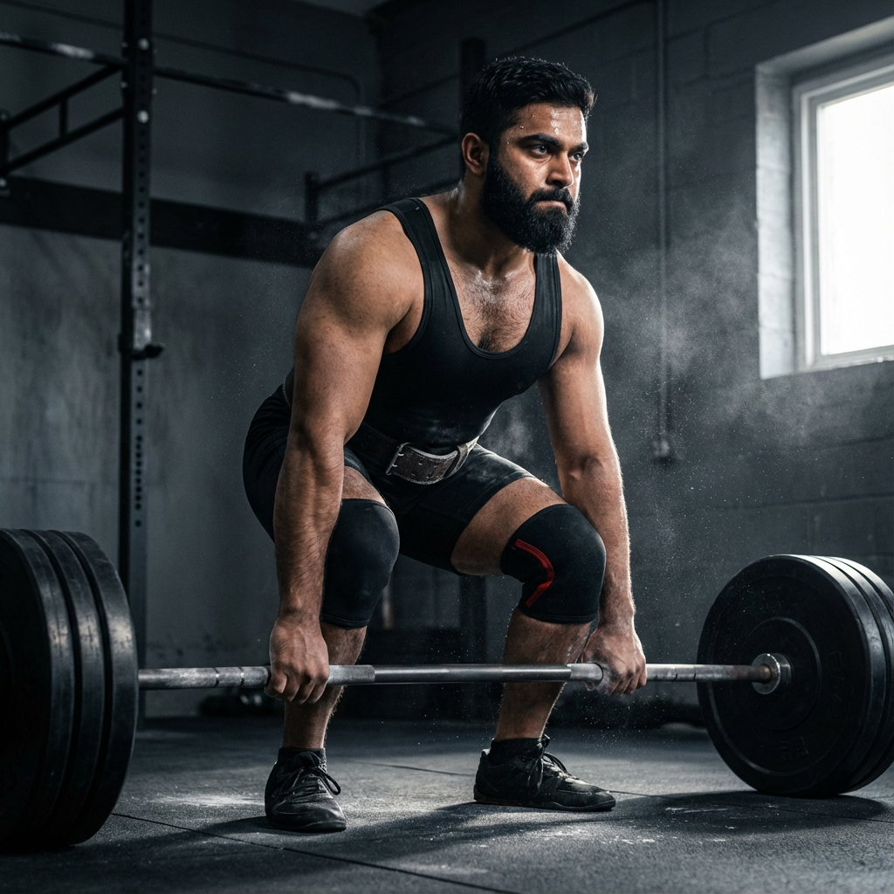

# 100KG NATTY - Elite Natural Bodybuilding Platform

<div align="center">
  
  <br/>
  <h3>Premium Coaching for Natural Athletes</h3>
</div>

<br/>

A high-performance web platform designed for elite natural bodybuilding coaching. Built with **React 19**, **TypeScript**, and **Tailwind CSS**, this application features a premium "ACID Green" aesthetic, smooth animations, and a seamless user experience.

## 🚀 Key Features

### 🏋️‍♂️ Training & Programs
- **Specialized Protocols**: Custom programs for **Hypertrophy**, **Shred**, **Powerlifting**, and **Contest Prep**.
- **Interactive UI**: 3D card tilts, zoom effects, and "Shimmer" buttons for premium interactivity.
- **Detailed Program Views**: Comprehensive breakdown of training modules and expected outcomes.

### ✨ Immersive Design
- **Theme Support**: Fully integrated **Dark & Light modes** with persistent preferences.
- **Motion & effects**: Powered by **Framer Motion** for scroll reveals, text gradients, and smooth transitions.
- **Glassmorphism**: Modern frosted glass elements combined with carbon fiber textures.

### 📊 Content & Engagement
- **Transformation Gallery**: Interactive before/after sliders showcasing real client results.
- **Blog System**: Full-featured blog with category filtering, search, and reading time estimates.
- **Success Stories**: Verified testimonials and client statistics.

### 🛠️ Technical Robustness
- **Responsive Architecture**: Mobile-first design ensuring perfect layouts across all devices.
- **Contact Integration**: Fully functional forms powered by **EmailJS** with validation.
- **Performance**: Optimized asset loading and component code-splitting.

## 📸 Snapshots

### Training Protocols
<div align="center">
  
  
</div>

### Transformations
<div align="center">
  
  
</div>

## 💻 Tech Stack

| Category | Technology |
|----------|------------|
| **Core** | React 19, TypeScript, Vite |
| **Styling** | Tailwind CSS, CSS Modules |
| **Animations** | Framer Motion, GSAP, CSS Keyframes |
| **Icons** | Lucide React |
| **Forms** | React Hook Form, EmailJS |

## 🏁 Run Locally

Follow these steps to set up the project locally:

1. **Install dependencies:**
   ```bash
   npm install
   ```

2. **Environment Setup:**
   Create a `.env.local` file and add your Gemini API key (if using AI features):
   ```env
   GEMINI_API_KEY=your_api_key_here
   ```

3. **Start the Development Server:**
   ```bash
   npm run dev
   ```

4. **Build for Production:**
   ```bash
   npm run build
   ```

---
<div align="center">
  Designed & Developed for <b>100KG NATTY</b>
</div>
